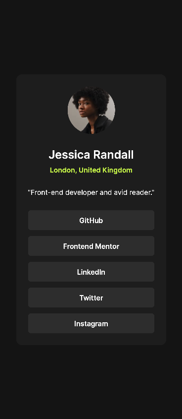

# Frontend Mentor - Social links profile solution

This is a solution to the [Social links profile challenge on Frontend Mentor](https://www.frontendmentor.io/challenges/social-links-profile-UG32l9m6dQ). Frontend Mentor challenges help you improve your coding skills by building realistic projects. 

## Table of contents

- [Overview](#overview)
  - [The challenge](#the-challenge)
  - [Screenshot](#screenshot)
  - [Links](#links)
- [My process](#my-process)
  - [Built with](#built-with)
  - [What I learned](#what-i-learned)
  - [Continued development](#continued-development)
  - [Useful resources](#useful-resources)
- [Author](#author)
- [Acknowledgments](#acknowledgments)

## Overview

### The challenge

Users should be able to:

- See hover and focus states for all interactive elements on the page

### Screenshot

### Links

- Solution URL: [GitHub](https://github.com/KaiWenzel/social-links-profile)
- Live Site URL: [Pages](https://kaiwenzel.github.io/social-links-profile/)

## My process

### Built with

- Semantic HTML5 markup
- CSS 
- Flexbox
- Mobile-first workflow

### What I learned

Using gap for flexbox to space out items equally is quite useful. It then get's harder when you need to change one's element distance to another, so for this I used negative margin, but this doesn't seem to be right. 

It's also a bit harder to gauge if you only got the image to work with instead of the Figma file. But when you use responsive design elements it's getting to look the same. But for profile pictures you'll always have to guess and look how it looks in proportion to the rest. But going with 32px or a multiple of it seems like a good fit usually. 

### Continued development

In future projects I would like to keep focusing on responsive design. I always want to continue with mobile first design.

### Useful resources

- [Gemini](https://gemini.google.com/) - Always helpful for identifying errors. 

## Author

- Website - Kai Wenzel (No official website yet)
- Frontend Mentor - [@KaiWenzel](https://www.frontendmentor.io/profile/KaiWenzel)

## Acknowledgments

Thanks to Frontend Mentor for providing me with the designs. 